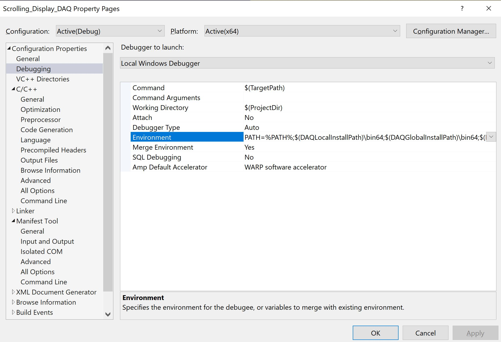

# DAQ Simulator in C : Scrolling Display "HELLO"

## Contents

* [Overview](#Overview)
	* [Project Expansions](#Project-Expansions)
* [Installations](#Installations)
    * [VS-2017](#Visual-Studio-2017)
    * [DAQ Library](#DAQ-Library)
		* [Encoding](#Encoding)
		* [Functions](#Functions)
* [Scrolling Algorithm](#Scrolling-Algorithm)
	* [Starting Message](#Starting-Message)
	* [Complete Message](#Complete-Message)
	* [Separated Message](#Separated-Message)
		* [Counters](#Counters)
	* [Finishing Message](#Finishing-Message)
	* [Program End](#Program-End)
* [Demonstrations](#Demonstrations)
* [Credit](#Credit)

## Overview

This repository contains a **C** program which iteratively scrolls a message on a set of 8-segment displays. This project was developed using the **Data Acquisition (i.e. DAQ)** library in the <b>Visual Studio 2017 IDE</b>.

### Project Expansions

The original implementation of this project was expanded to incorporate standard input/output, switch event functionality, and improve program performance through the reduction of refresh cycles.

In the interest of writing portable and reusable code, the source code was refactored to implement purposeful functions in separate source files. The comments in the **C** source files go into further detail of the program functionality.

## Installations

### Visual Studio 2017

The **C** source code is written to be compiled and run in the <b>Visual Studio 2017 IDE</b>. This <b>IDE</b> is also required for <b>DAQ</b> library installation on the <b>Windows OS</b>. The [(`Scrolling_Display_DAQ.sln`)](project/Scrolling_Display_DAQ.sln) solution file can be opened in the <b>Visual Studio</b> software.

<b>Configuration Properties</b> in the <b>VS Solution Explorer</b> :

<ul>
    <li><b>Configuration Properties->Debugging->Environment</b> :  <i>PATH=%PATH%;$(DAQLocalInstallPath)\bin64;$(DAQGlobalInstallPath)\bin64;$(LocalDebuggerEnvironment)</i></li>
    <li><b>C/C++->General->Additional Include Directories</b> :  <i>$(SolutionDir)\\Scrolling_Display_DAQ\\include;$(SolutionDir)\Scrolling_Display_DAQ\src;$(DAQLocalInstallPath)\include;$(DAQGlobalInstallPath)\include;%(AdditionalIncludeDirectories)</i></li>
    <li><b>Linker->General->Additional Library Directories</b> :  <i>$\(DAQLocalInstallPath\)\\lib64;$(DAQGlobalInstallPath)\lib64;%(AdditionalLibraryDirectories)</i></li>
</ul>

    

### DAQ Library

The <b>DAQ</b> **C** library is installed to gain access to the simulator used in this program. I have included the [(`DAQlib`)](project/DAQlib) installation folder in the repository.

In order to gain access to the <b>DAQ</b> functions in our program, we must include the [(`DAQlib.h`)](project/DAQlib/include/DAQlib.h) header file in our code.

#### Encoding

The 8-segment displays in the <b>DAQ</b> library are driven by active-high outputs (i.e. set a bit to *0* to turn the segment **OFF** and *1* to turn the segment **ON**.)

We have encoded the relevant possible displays in the [(`main.h`)](project/Scrolling_Display_DAQ/include/main.h) and [(`counters.h`)](project/Scrolling_Display_DAQ/include/counters.h) header files as shown in the table below.

| 8-Segment Display | Code |
| -------- | ---------- |
| <b>H</b> | 0b01101110 |
| <b>E</b> | 0b10011110 |
| <b>L</b> | 0b00011100 |
| <b>O</b> | 0b11111100 |
| <b>b</b> | 0b00111110 |
| <b>y</b> | 0b01110110 |
| <b>e</b> | 0b11011110 |
| <b>0</b> | 0b11111100 |
| <b>1</b> | 0b01100000 |
| <b>2</b> | 0b11011010 |
| <b>3</b> | 0b11110010 |
| <b>4</b> | 0b01100110 |
| <b>5</b> | 0b10110110 |
| <b>6</b> | 0b10111110 |
| <b>7</b> | 0b11100000 |
| <b>8</b> | 0b11111110 |
| <b>9</b> | 0b11110110 |

#### Functions

We must setup our simulator by calling the int `int setupDAQ(int setupNum);` function. We leave the <b>DAQ</b> configuration to the user to decide, but it's expected that a hardware module is unavailable.

Afterwards, we write message bytes to positions on the digital display by calling the  `void displayWrite(int data, int position);` function. The `void delay(unsigned long ms);` function gives us the ability of periodically shifting the message on the digital displays.

In addition to the scrolling functionality, this program incorporates switch channels. We call the  `int digitalRead(int channel);` function to read the current digital state of the switch channels. For our purposes, we use the switches to run and reset our scrolling display.

## Scrolling Algorithm

The functions which are used to scroll the message on the 8-segment displays are implemented in the [(`main.c`)](project/Scrolling_Display_DAQ/src/main.c) source file. These were developed from display cases determined prior to writing the source code.

### Starting Message

The `void shiftStartingMessage(uint8_t* message, uint8_t message_length);` function is used to implement the following display cases.

| <b>Display Case</b> | <b>Digital Displays</b> |
| -------- | ----------------------- |
| <b>A</b> | __ __ __ __ __ __ __ __ |
| <b>B</b> | __ __ __ __ __ __ __ H_ |
| <b>C</b> | __ __ __ __ __ __ H_ E_ |
| <b>D</b> | __ __ __ __ __ H_ E_ L_ |
| <b>E</b> | __ __ __ __ H_ E_ L_ L_ |

### Complete Message

The `void shiftCompleteMessage(uint8_t* message, uint8_t message_length, uint8_t counter);` function is used to implement the following display cases.

| <b>Display Case</b> | <b>Digital Displays</b> |
| -------- | ----------------------- |
| <b>F</b> | __ __ __ H_ E_ L_ L_ O_ |
| <b>G</b> | __ __ H_ E_ L_ L_ O_ __ |
| <b>H</b> | __ H_ E_ L_ L_ O_ __ 9_ |
| <b>I</b> | H_ E_ L_ L_ O_ __ 9_ __ |

For this example, our scrolling display counter is *9*.

### Separated Message

The `void shiftSeparatedMessage(uint8_t* message, uint8_t message_length, uint8_t counter);` function is used to implement the following display cases.

| <b>Display Case</b> | <b>Digital Displays</b> |
| -------- | ----------------------- |
| <b>J</b> | E_ L_ L_ O_ __ 9_ __ H_ |
| <b>K</b> | L_ L_ O_ __ 9_ __ H_ E_ |
| <b>L</b> | L_ O_ __ 9_ __ H_ E_ L_ |
| <b>M</b> | O_ __ 9_ __ H  E_ L_ L_ |
| <b>N</b> | __ 9_ __ H_ E_ L_ L_ O_ |
| <b>O</b> | 9_ __ H_ E_ L_ L_ O_ __ |

For this example, our scrolling display counter is *9*.

#### Counters

The `void shiftCompleteMessage(...);` and `void shiftSeparatedMessage(...);` functions have been written to handle single digit and double digit counters. Based on the appropriate display position, they call the  `void writeCounter(uint8_t counter, int8_t starting_position);` function from the [(`counters.c`)](project/Scrolling_Display_DAQ/src/counters.c) source file. The following display cases are implemented when the scrolling display counter is greater than *9*.

| <b>Display Case</b> | <b>Digital Displays</b> |
| -------- | ----------------------- |
| <b>P</b> | __ H_ E_ L_ L_ O_ __ 1_ |
| <b>Q</b> | H_ E_ L_ L_ O_ __ 1_ 9_ |
| <b>R</b> | E_ L_ L_ O_ __ 1_ 9_ __ |
| <b>S</b> | L_ L_ O_ __ 1_ 9_ __ H_ |
| <b>T</b> | L_ O_ __ 1_ 9_ __ H_ E_ |
| <b>U</b> | O_ __ 1_ 9_ __ H_ E_ L_ |
| <b>V</b> | __ 1_ 9_ __ H_ E_ L_ L_ |
| <b>W</b> | 1_ 9_ __ H_ E_ L_ L_ O_ |
| <b>X</b> | 9_ __ H_ E_ L_ L_ O_ __ |

For this example, our scrolling display counter is *19*.

### Finishing Message

The `void shiftFinishingMessage(uint8_t* message, uint8_t message_length, uint8_t counter);` function is used to implement the following display cases.

| <b>Display Case</b> | <b>Digital Displays</b> |
| -------- | ----------------------- |
| <b>Y</b> | E_ L_ L_ O_ __ 1_ 9_ __ |
| <b>Z</b> | L_ L_ O_ __ 1_ 9_ __ __ |
| <b>a</b> | L_ O_ __ 1_ 9_ __ __ __ |
| <b>b</b> | O_ __ 1_ 9_ __ __ __ __ |
| <b>c</b> | __ 1_ 9_ __ __ __ __ __ |
| <b>d</b> | 1_ 9_ __ __ __ __ __ __ |
| <b>e</b> | 9_ __ __ __ __ __ __ __ |
| <b>f</b> | __ __ __ __ __ __ __ __ |

For this example, our scrolling display counter is *19*.

### Program End

The `void endDisplay(uint8_t* message, uint8_t message_length, uint8_t counter);` function is used to implement the following display cases. After the scrolling iterations of the <i>'HELLO'</i> message have finished, a <i>'byebye'</i> message is scrolled to conclude the program. This is done by calling the `void shiftStartingMessage(...);`,  `void shiftCompleteMessage(...);`, and `void shiftFinishingMessage(...);` functions.

| <b>Display Case</b> | <b>Digital Displays</b> |
| -------- | ----------------------- |
| <b>g</b> | __ __ __ __ __ __ __ b_ |
| <b>h</b> | __ __ __ __ __ __ b_ y_ |
| <b>i</b> | __ __ __ __ __ b_ y_ e_ |
| <b>j</b> | __ __ __ __ b_ y_ e_ b_ |
| <b>k</b> | __ __ __ b_ y_ e_ b_ y_ |
| <b>l</b> | __ __ b_ y_ e_ b_ y_ e_ |
| <b>m</b> | __ b_ y_ e_ b_ y_ e_ __ |
| <b>n</b> | b_ y_ e_ b_ y_ e_ __ __ |
| <b>o</b> | y_ e_ b_ y_ e_ __ __ __ |
| <b>p</b> | e_ b_ y_ e_ __ __ __ __ |
| <b>q</b> | b_ y_ e_ __ __ __ __ __ |
| <b>r</b> | y_ e_ __ __ __ __ __ __ |
| <b>s</b> | e_ __ __ __ __ __ __ __ |
| <b>t</b> | 8. 8. 8. 8. 8. 8. 8. 8. |

## Demonstrations

The videos in the [`demonstrations`](demonstrations) directory show the <b>DAQ</b> configuration and the program output on the software simulator. This directory is tracked using <b>Git LFS</b> due to size restrictions.</i> We have embedded these files below.

https://user-images.githubusercontent.com/52113009/136477404-4c0342cc-c598-47fd-985b-32a8e45c78fd.mp4

https://user-images.githubusercontent.com/52113009/136477416-e8a16141-e2a9-410c-a605-aa397f87b755.mp4

## Credit

The idea for this project was derived from <b>The University of British Columbia Electrical and Computer Engineering</b> undergraduate program. The <b>APSC 160 - Introduction to Computation</b> course requirement involves a final project which is a simplified scrolling display. The source code was also refactored and heavily expanded after a formal introduction to <b>Pointers</b> in <b>CPSC 259 : Data Structures and Algorithms for Electrical Engineers</b>.

The <b>DAQ</b> library is provided by the <b>UBC ECE Department</b> for academic use. This project was not used as a course submission and was developed from scratch.
