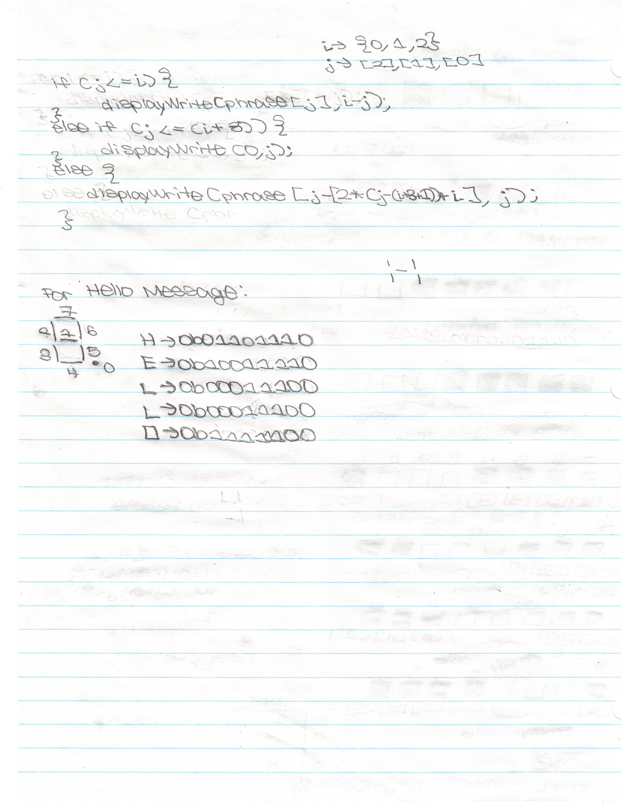

# C Program : Scrolling Display 'HELLO'

## Contents
* [Overview](#Overview)
    * [Code Refactoring](#Code-Refactoring)
* [Display Cases](#Display-Cases)
    * [Shift Algorithm](#Shift-Algorithm)
* [Source Code](#Source-Code)
    * [Encoding](#Encoding)
* [Credit](#Credit)

## Overview

A simple <b>C</b> project was written using programming concepts taught in <b>APSC 160 - Introduction to Computation</b>.

In order to simulate a "Scrolling Display", the (`DisplayWrite(int data, int position)`) function from the <b>Data Acquisition Module (i.e. DAQ) Library</b> is used. This is provided by <b>The University of British Columbia Electrical and Computer Engineering Department</b> for academic use.

<i>Note that <b>Visual Studio 2017</b> on <b>Windows OS</b> is required for <b>DAQ Library</b> installation.</i>

### Code Refactoring

This project was heavily refactored after a formal introduction to <b>Pointers</b> in <b>CPSC 259 : Data Structures and Algorithms for Electrical Engineers</b>.

Even though the original implementation was functional, it was difficult to read. To better implement modularity as a programmer, I separated my solution into several functions and made the code documentation more easily understood.

#### Te

## Display Cases

These were illustrated prior to writing the source code.

## Encoding

The 7-Segment Display in the <b>DAQ Library</b> is driven by active-high outputs (i.e. 0 values turn the segment **OFF** and 1 values turn the segment **ON**.)

We have encoded the relevant
possible displays in the [(`main.h`)](main.h) and [(`counters.h`)](counters.h) header files as shown in the table below.

| 7-Segment Display | Code |
| ----------------- | ---- |
| H | 0b01101110 |
| E | 0b10011110 |
| L | 0b00011100 |
| O | 0b11111100 |
| - | ---------- |
| 0 | 0b11111100 |
| 1 | 0b01100000 |
| 2 | 0b11011010 |
| 3 | 0b11110010 |
| 4 | 0b01100110 |
| 5 | 0b10110110 |
| 6 | 0b10111110 |
| 7 | 0b11100000 |
| 8 | 0b11111110 |
| 9 | 0b11110110 |

### Shift Algorithm

In order to effectively loop through the <i>'Shift Cases'</i>, the displays were separated into 3 categories : **OccupiedLeft**, **EmptyMid**, and **OccupiedRight**.

The phrase character in each display position is determined through the following algorithm formulated with through mathematical reasoning over several iterations.

 ---------------------------------------------------------------------------------------------------------------------------- 

## DAQ Simulation

The video in the [`demonstrations`](demonstrations) directory shows the end result of this procedure as well as the output on the <b>DAQ Simulation</b>. This directory is tracked using <b>Git LFS</b> due to size restrictions.</i> We have embedded a low resolution compressed version of this files below.

## Credit

The idea for this project was derived from <b>The University of British Columbia Electrical and Computer Engineering</b> Undergraduate program. The <b>APSC 160 - Introduction to Computation</b> course requirement involveS a final project which acted as the inspiration for this program. A Scrolling 'HELLO' Display originally designed using <b>C Programming</b> concepts in <b>APSC 160</b> was refactored through the use of advanced programming principles.

The entire design document is included in the [(`design.pdf`)](design.pdf) file.